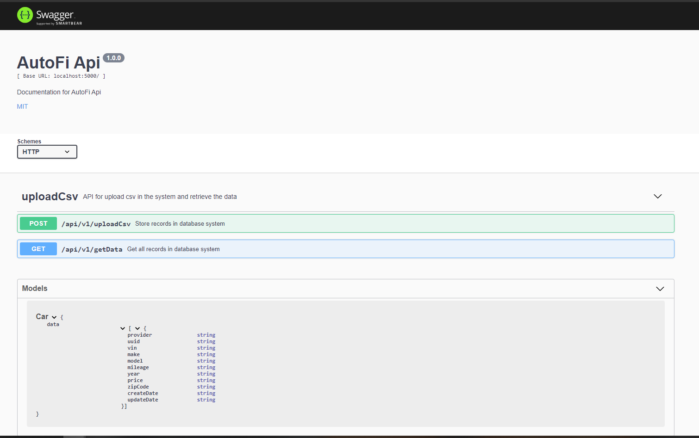
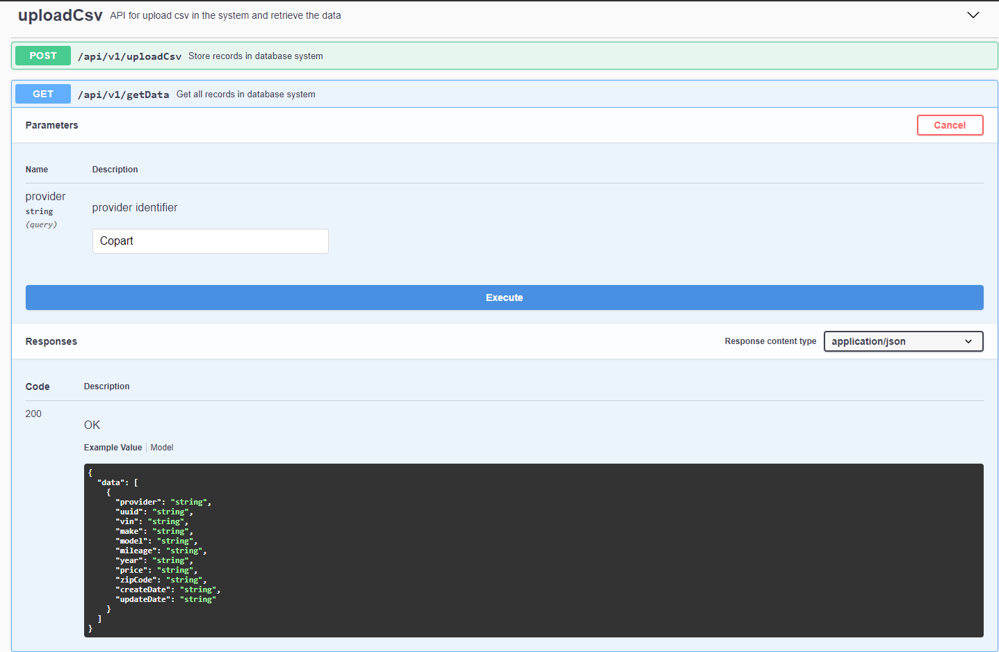
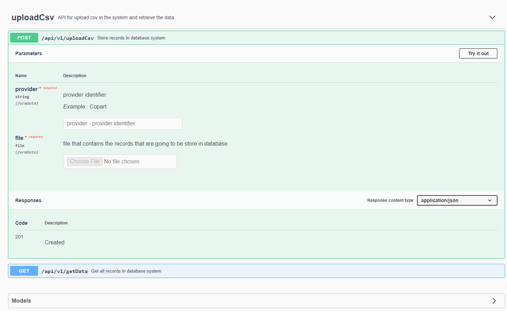

# Backend Proximity Challenge [](https://travis-ci.org/CristianTurcios/Backend-proximity-challenge)

## Technologies

- TypeScript
- Swagger
- ExpressJs
- Jest
- Multer
- Mongo
- Mongoose
- Joi
- nodemon
- eslint - airbnb style
- Travis CI

## Installation

```bash
$ npm install
```

## Running the app

```bash
# development
$ npm run start
```

## Test

```bash
# unit tests
$ npm run test
```

## Swagger Documentation

```bash
# Swagger Documentation
$ npm run start
```

Open a new tab in your web browser and put this url: <http://localhost:5000/api-docs/>

### **NOTE**

- You can find an example of the file to upload in the api post method, inside the `files/dummyData.csv` folder.
- You can use and import this [collection](https://www.getpostman.com/collections/e0837523b9e4f8a2a62f) from POSTMAN to be able to test the api
- When the project is configured and running successfully you can find the API documentation that was written using swagger by putting this URL in your web browser:
<http://localhost:5000/api-docs/>

### Swagger Documentation Screenshots






